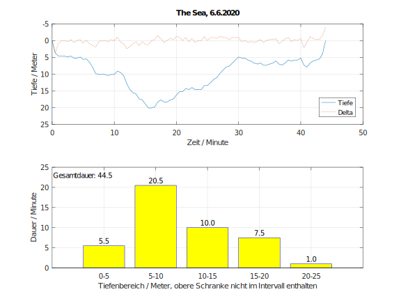

# Visualize dive profile
Generate dive profile using GNU Octave:

 

## Requirements
 * [GNU Octave](https://www.gnu.org/software/octave/) 

## Generate profile
* Edit the following variables in `diveprofile.m`
  * `workingdir`
  * `sourcefilename`
  * `divelocation`
  * `divedate`
* Create SVG-file
  * `octave diveprofile.m 2> /dev/null`
* Convert SVG-file to PDF (optional)
* `inkscape --export-pdf=output.pdf figure1.svg`
 